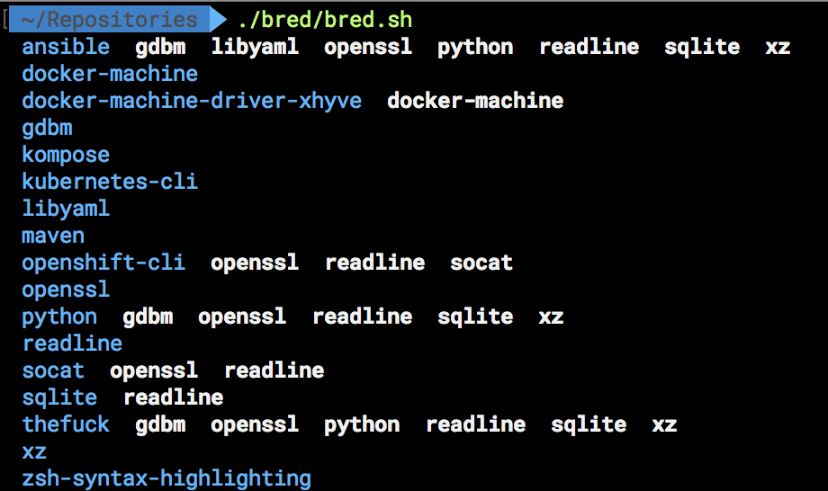

# bred

This is a shell script which contains of brew's dependency list.



## Clone

```bash
~$ git clone https://github.com/serrodcal/bred.git
```

## Execution permission

```bash
~$ chmod +x bred/bred.sh
```

## Run

```bash
~$ ./bred/bred.sh
```

